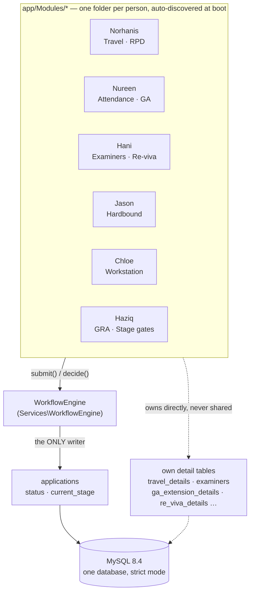

# UResearch 2.0 — Architecture & Technology Stack

*Centre for Graduate Studies, Universiti Teknologi PETRONAS — Final Year Project, six-member team.*
*Supervisor: Dr. Savita K. Sugathan · Examiner: Dr. Helmi B Mohd Rais*
*Stack: Laravel 12 · PHP 8.3 · MySQL 8.4 · Redis · Docker*

Written up as source material for a pitch deck or project report — every figure and file path below is drawn directly from the codebase (`composer.json`, `docker-compose.yml`, `docs/architecture.md`, `docs/migration-from-legacy.md`), not approximated.

---

## The problem this replaced

Before this rewrite, CGS ran on **four divergent copies** of a raw-PHP application — one root copy and one per developer, each with its own `schema.sql`. Fourteen near-identical approval pages checked authorisation inconsistently, some not at all. An examiner's mandatory 90-day cooling-off period was recorded in the database and never once read back.

The rewrite's job wasn't to add features. It was to make the four copies into one, and make the rules the FYP scope documents already promised actually hold.

**The answer:** one app, one database, six people who each own exactly one folder — and a single engine that is the only code in the system allowed to say an application moved forward.

---

## The mechanism: how six people write to one database without colliding

Nothing central lists the modules. Each teammate's folder is discovered by convention at boot (`ModuleServiceProvider` scans `app/Modules/*`), and every module is free to invent its own tables — but none of them may touch the two columns that say where an application actually is. That rule is enforced in exactly one class, `WorkflowEngine`.

Solid arrows: every module calls **the same two methods** — `submit()` and `decide()` — to move an application forward; `WorkflowEngine` is the only class in the codebase allowed to write `applications.status` or `current_stage`. Dashed arrows: each module still owns its own tables outright and writes them directly — `WorkflowEngine` never sees a `travel_details` row. Jason, Chloe and Haziq's folders exist and are wired into this same mechanism; their tables aren't built yet.

---

## The technology stack

Nothing here is decorative. Every dependency closes a specific gap the legacy app left open, or answers a specific requirement in the FYP scope documents.

### Language & framework

| Technology | Version | Purpose |
|---|---|---|
| **PHP** | `^8.2`, runs 8.3.33 in containers | The legacy app's language, kept deliberately — a restructuring of the same codebase's problem, not a platform migration the team would have had to relearn under deadline. |
| **Laravel** | `^12.0` | Routing, ORM (Eloquent), migrations, templating, session/auth scaffolding, a queue abstraction, and the service-container that makes module auto-discovery possible. |
| **Eloquent ORM** | bundled | Every query is parameterised by construction — the legacy app's raw string-concatenated SQL is structurally impossible to reintroduce by accident. |

### Data & persistence

| Technology | Version | Purpose |
|---|---|---|
| **MySQL** | 8.4, Docker | One database, not four. Runs in **strict mode** (`docker/mysql/my.cnf`) specifically because the legacy app's lenient mode let `ga_extension_cgs.php` write `decision='reviewed'` into an `ENUM` that didn't contain it — MySQL silently blanked the value instead of rejecting it. |
| **Redis** | 7-alpine, Docker | Backs the queue (`QUEUE_CONNECTION=redis`) that `ApplicationDecided` notifications run through, so a slow SMTP handshake never blocks the HTTP request an approver is waiting on. |
| **Session & cache** | `database` driver | Both ride the same MySQL instance rather than adding a second store to operate — a deliberate simplicity trade-off appropriate to the portal's scale. |

### Background work

| Technology | Purpose |
|---|---|
| **Laravel Queue** (`uresearch-queue` container) | Runs `php artisan queue:work` continuously — every notification and scheduled reminder (e.g. `supervision:remind-stalled`) processes outside the request/response cycle. |

### Presentation

| Technology | Version | Purpose |
|---|---|---|
| **Blade** | bundled | Server-rendered templates, `{{ }}` escaping **on by default**. The legacy app's 12 approval pages contained 64 raw `echo $row[...]` calls of unescaped student input — this closes that class of stored XSS structurally. |
| **No JS framework** | no `package.json` | A deliberate omission. No Vite/webpack build step — every script and stylesheet is a static file, which is also what makes the strict CSP below enforceable without a build pipeline fighting it. |
| **Chart.js** | 4.4.1 + datalabels 2.2.0 | Self-hosted from `public/js`, not a CDN — the FYP stack document's choice, and a requirement of the CSP, which names no external script origin at all. |

### Documents & data exchange

| Technology | Version | Purpose |
|---|---|---|
| **barryvdh/laravel-dompdf** | `^3.0` | Generates the GA/GRA certification letter and (once built) Jason's appointment letters and Dean-PFR reports — pure-PHP rendering, no external binary needed in production. |
| **maatwebsite/excel** | `^4.0` | Both directions of Nureen's Attendance module: importing the CSV/XLSX export CGS pulls from UTrace, and exporting a blank template — the deliberate answer to "no UTP API access." |

### Security

| Technology | Purpose |
|---|---|
| **Content-Security-Policy** (`ContentSecurityPolicy` middleware, hand-written) | `script-src` names **no origin at all** — a script runs only if it's this app's own file or carries the current request's random nonce. No `unsafe-inline`, no `unsafe-eval`, for scripts. Holds if Blade's escaping is ever bypassed by mistake. |
| **Role middleware + engine check** (`EnsureRole`) | Two independent locks on every decision: route middleware refuses the wrong role before the controller runs; `WorkflowEngine::decide()` separately re-checks the actor against the exact stage the application is sitting on. |

### Observability & audit

| Technology | Version | Purpose |
|---|---|---|
| **spatie/laravel-activitylog** | `^4.12` | A second, independent audit layer from `approval_history`: every sign-in, decision, upload and document *view* lands in `activity_log`, surfaced at `/admin/audit-logs`. |

### Containerisation & ops

| Technology | Purpose |
|---|---|
| **Docker** | The entire stack runs in containers — app, queue worker, database, cache/broker, mail catcher, DB admin UI. A teammate's only local prerequisite is Docker itself; every machine on the team runs the identical PHP version, MySQL version and extension set. The direct fix for "everyone loads a `.sql` file into their own XAMPP by hand." |
| **Docker Compose**, 6 services | Wires up all six: `laravel.test` (app, Sail's PHP 8.3 runtime), `queue`, `mysql`, `redis`, `mailpit`, `phpmyadmin`. One command, `docker compose up -d` (or this repo's own `setup.sh`), brings up the whole networked system with a named volume so the database survives a restart. |
| **Mailpit** | Every notification email is genuinely sent and visible at `localhost:8025` — no real inbox or credential needed in development; real SMTP in production, same code path. |

### Testing

| Technology | Version | Purpose |
|---|---|---|
| **PHPUnit** | `^11.0` | 18 test classes, **88 tests** (as of 2026-09-17), laid out one folder per owner under `tests/Feature/` plus `tests/Unit/`. They cover the workflow engine's two authorisation locks, the CSP header, module-contract conformance, the attendance import and its risk rule, and the approval chains of Norhanis', Nureen's and Hani's modules end to end. SQLite in memory, so the suite needs no Docker and cannot touch a developer's database. The legacy app had none. |

---

## Three design decisions that look small and aren't

**VARCHAR, never ENUM.** `role`, `status`, `module_type` and `decision` are all plain `VARCHAR`, with valid values enforced in PHP (`Support\Role`) rather than at the schema level. An `ENUM` means adding one role requires an `ALTER TABLE` on a table five other people also depend on — precisely how the legacy app ended up with three incompatible `schema.sql` files.

**Status and stage are different questions.** `applications.status` answers only open/done/dead; `current_stage` holds a machine key for where it's sitting. The legacy app conflated them across three different conventions, so a GA Extension application could render on the shared tracking page as a *Claims* application, stuck on step one forever.

**Convention over a central registry.** `ModuleServiceProvider` scans `app/Modules/*` at boot and wires up whatever it finds. Nothing anywhere lists the six modules by name — the actual mechanism behind "adding a module causes no merge conflict," not just a stated intention.

**Derived state over stored state.** An examiner's four-state machine (Available / On Gap / Assigned / Unavailable) is computed on read from two dates, never stored as a column. The legacy schema captured `last_examination_date` and never read it back — the 90-day rule existed in the FYP scope document and nowhere in the running code.

---

## The legacy app, measured

Concrete findings from a full audit of the raw-PHP predecessor, recorded in `docs/migration-from-legacy.md` so none of them get reintroduced.

| | |
|---|---|
| **4** | divergent codebases, one per developer plus a root copy — unified into one app |
| **0 of 12** | approval pages checked whether the logged-in user held the right *role* — any student could open the Dean's approval URL |
| **64** | raw unescaped `echo` calls of student-supplied data across those pages — stored XSS, every one |
| **1** | web-reachable script with no `WHERE` clause that could reset *every* account's password, for any visitor |

| Was | Now |
|---|---|
| `ga_extension_form.php` ran `mkdir(0777)`, kept the original filename, checked neither MIME type nor extension, and wrote under the webroot. A `.php` upload was remote code execution. | `DocumentStore` is the only sanctioned path: extension allow-list, size cap, random filename, private disk, streamed back only through an authorised controller. |
| 14 near-identical hand-written approval pages, each re-implementing "log the decision, work out the next stage, update the row, email the student" — and each drifting slightly from the others. | One `WorkflowEngine`, called the same two ways by every module. |
| SMTP credentials committed in plain text inside `send_email.php`. | `.env`, git-ignored; Mailpit locally, so development needs no real credential at all. |
| Login had no rate limit, and distinguished "wrong password" from "no such account" in its error message. | Five attempts per email+IP per minute; one identical message for both failure modes. |

---

## Ownership — six folders, six people

Everyone owns exactly one directory under `app/Modules/` — migrations, models, controllers, routes and views, entirely self-contained. `Core/` is the one shared folder, and changing it is a team decision, not a unilateral one.

| Folder | Owner | Scope | Status |
|---|---|---|---|
| `Core/` | the team | Auth, WorkflowEngine, uploads, layout | shared foundation |
| `Norhanis/` | Norhanis Erna Natasha | Travel · Publication · Claims · RPD | Travel built (reference implementation) |
| `Nureen/` | Nureen Nellysha | Attendance · GA Extension · Supervision · Certification | built |
| `Hani/` | Nur Hani Sofia | Examiner Nomination · Conflict Detection · Re-viva | built |
| `Jason/` | Jason | Hardbound Submission · Appeal · Appointment Letters | scoped |
| `Chloe/` | Chloe Ching Qing En | Workstation · Candidacy Reminder / Appeal / Dismissal | scoped |
| `Haziq/` | Abdul Haziq bin Abdul Farouk | GRA · GA · Stage Gates · Allowance Eligibility | scoped |

---

*Sources: `docs/architecture.md`, `docs/migration-from-legacy.md`, `composer.json`, `docker-compose.yml`, `TODO.md`, `docs/module-keys.md`.*
